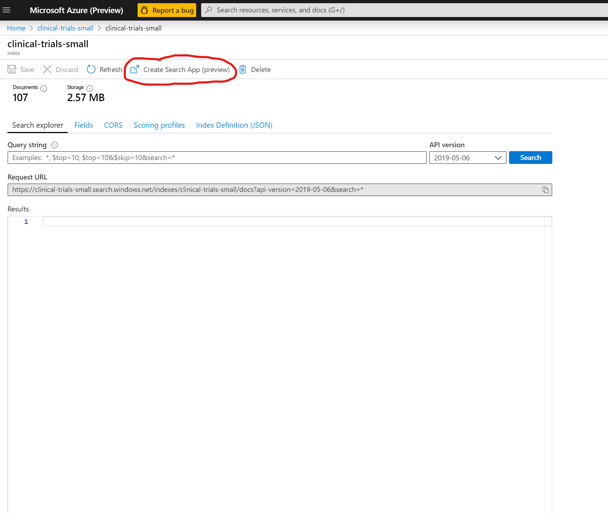
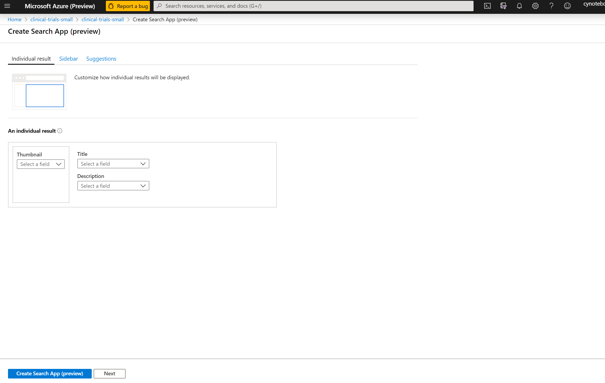
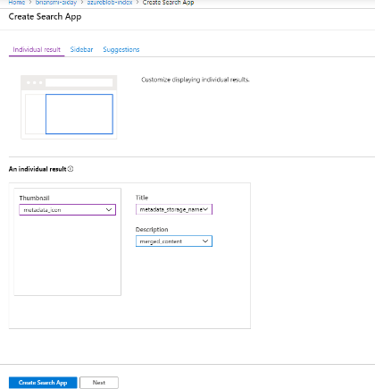
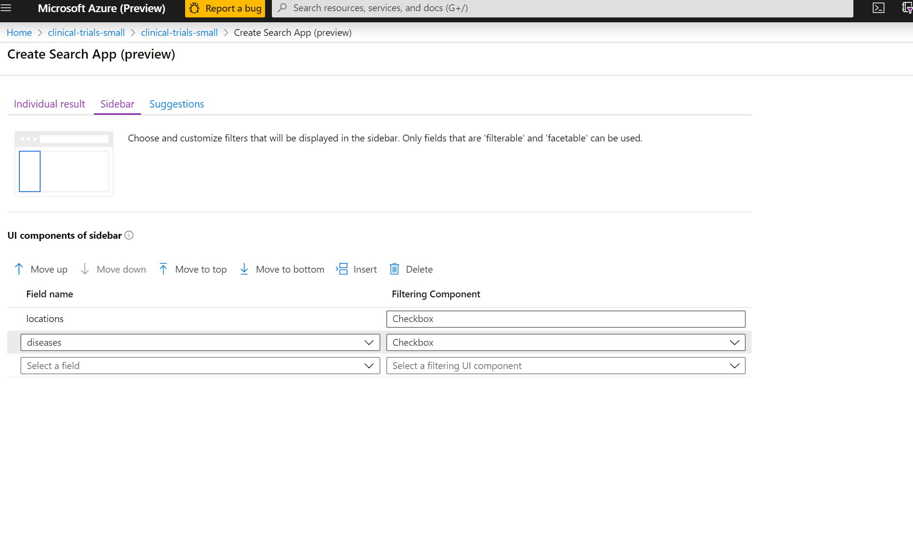
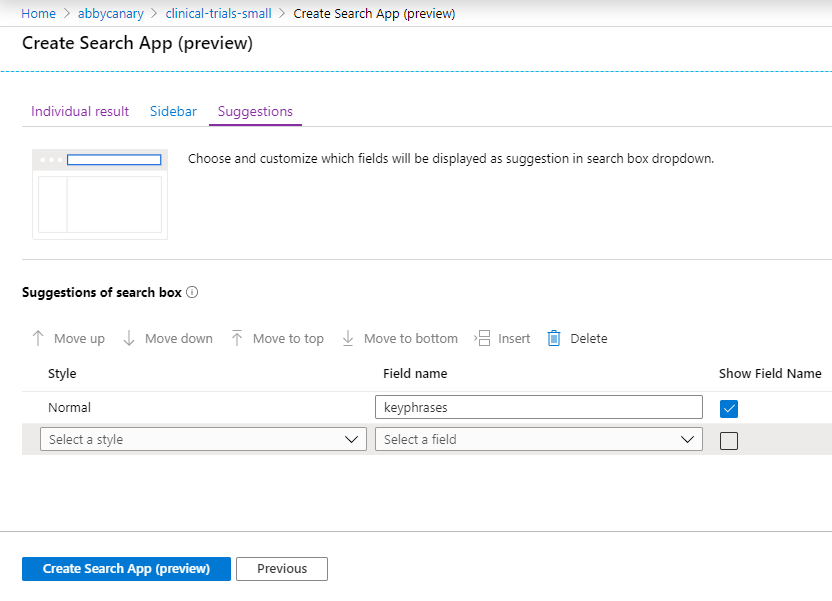
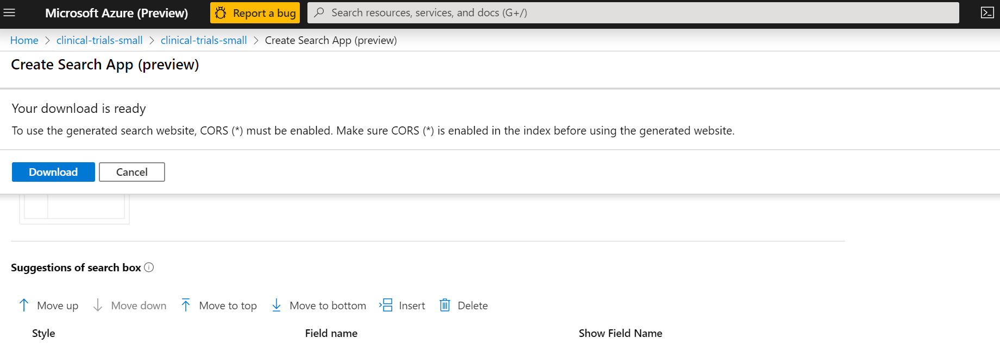
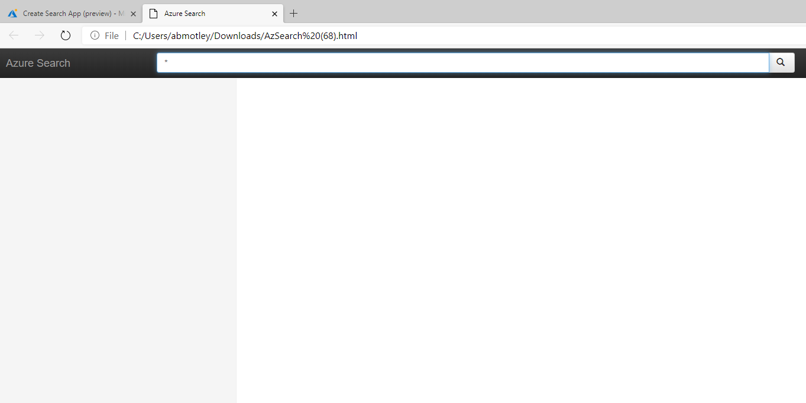
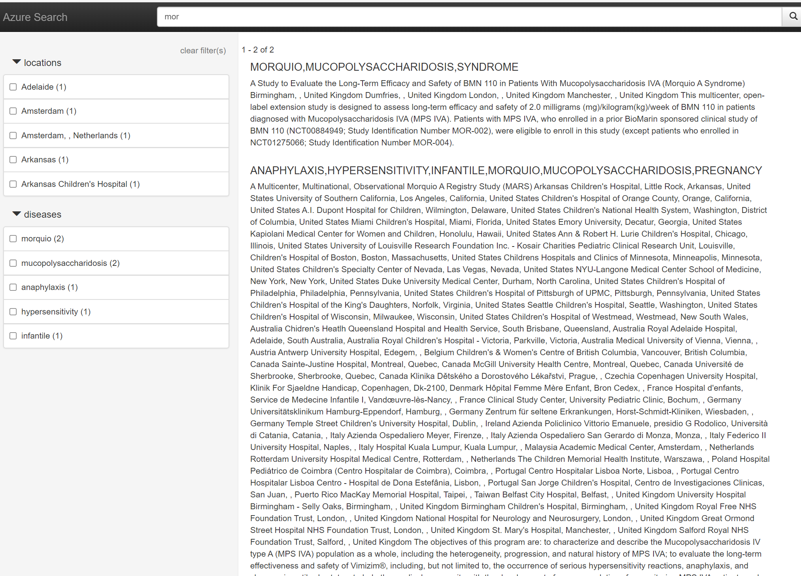

# Module 2: Visualizing the Results with the Create Search App
Now that you've built your Search index, we'll take a moment to visualize your results using the new **Create Search App** feature in the Azure Portal.  This is a new experience that we've devloped to allow developers to quickly create standalone search experiences to explore Azure Cognitive Search indexes.

*Note, the web page that is developed by the Create Search App is for DEMO purposes only, it should not be used to implement a production front end.*

To get started, click on your *clinical-trials-small* index, this will bring you back to the *Search Explorer* window.

Click on Create Search App at the top of the screen.

You should now see the application designer view that we will be walking through to build our web page.

Let's walk through your options step-by-step:

## Individual result
This page allows you to format the layout of how you want your search results to be displayed in the web page.  You'll see some very basic options to add a Thumbnail image, select a title and descritpion level information for your search results.

1. Thumbnails are most powerful when you have Image files to display with your search results.  For the purposes of the data in this lab, we will set Thumbnail to **metadata_icon**
2. Title - This is going to display as a title or header on your search results.  Click on the down arrow and select *metadata_storage_name* for the title.
3. Description is the text or content you want to display with your title field.  Click on the down arrow and select *merged_content*.

Click on the *Next* button.
## Sidebar
You are now on the Sidebar design page.  The sidebar is where you can help to guide the users search experience, by adding the facets and filters you created during the index design process as well as choosing which order you'd like to display them in.  The defaults you see populated here are fine for this lab.

Click *Next*

## Suggestions

This page allows you to choose and customize which fields wil be displayed as suggestions when you type into the search bar dropdown.  Fields you select as Suggestions on this page should have been marked with the Suggester flag during index creation.  Set this to **keyphrases**.

Click on **Create Search App** at the bottom of the screen. 

You will see message that your download is ready and that to use the generated website, CORS must be enabled.  Click on the **Download** button.

The web page you have designed is now ready to use!  If you are using Microsoft Edge, you will find the Open File link in the bottom left corner of your screen.

Click on the link to launch your new web page.

Type **mor** in the Search window and hit return.  You will now see the articles that contain your search term in the main window.  Note that on the left hand side of the page, you can also further filter your search results using the facets your defined earlier in this exercise.  Click on a few of these filters to see how your search results change.

You have now successfully built your search index and a demo search app, without ever having to leave the Azure portal!  At this point, you have a fully functioning application/demo that can be used to showcase Azure Cognitive Search to your customers.  As noted however, the webpage front end developed with the Create Search app is *not* production ready and should not be used as the front end for any production solution you would develop.  

To further accelerate your development efforts, we have provided you with a number of resources that can be used to build a production ready front-end search experience.

1. [The JFK Files](https://github.com/microsoft/AzureSearch_JFK_Files)
2. [The KM Solution Accelerator](https://github.com/Azure-Samples/azure-search-knowledge-mining)

And you are always welcome to build your own custom front-end experience as customer needs dictate.  Connection to your Azure Search index is as easy as integrating an API call through a tool such as Visual Studio to bring your search experience to life.

### Next: [Module 3: Using the Azure Portal to edit JSON files](Module&#32;3.md)

