# Using the Azure Portal to Iterate on Your Solution

In this module, we will show how you can easily iterate and add new capabilities your search index and knowledge store without leaving the portal experience.  You will learn how to use the Azure Portal JSON editors to add additional skills to your skillset by modifying the existing skillset, index, and indexer.

## Reprocessor
Before we start adding to our skillset, we will want to enable the new [incremental enrichment](https://docs.microsoft.com/en-us/azure/search/search-howto-incremental-index), or reprocessing capability in Azure Cognitive Search.  This new feature allows you to add caching to the enrichment pipeline so that you can incrementally modify steps without having to rebuild your index.  By default, a skillset is stateless, and changing any part of its composition requires a full rerun of the indexer. With incremental enrichment, the indexer can determine which parts of the document tree need to be refreshed based on changes detected in the skillset or indexer definitions. Existing processed output is preserved and reused wherever possible.

1. Open your Azure Cognitive Search service.
2. Click on the *Indexer* you created in module 1
3. Click on the **Reset** button. Prior to using the cache for the first time, the indexer must be reset.
4. Click on *Indexer Definition (JSON)*.  You will see the JSON defintion of your indexer on the left hand side of the screen.  On the right hand side, you will see some informaton about Indexers and the Indexer Cache.  Click on the blue button **Get Cache Connection String**.

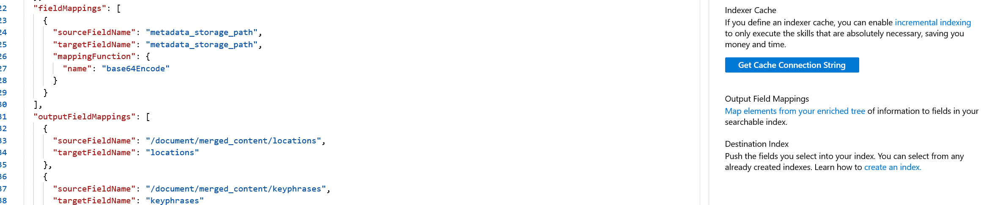

You will now be asked to select the storage account you want to enable the cache for.  Select the *clinical-trials-small* storage and *clinical-trials-small* container we worked with in module 1.  Hit **Select**

You should now see that the box under **Get Cache Connection String** has now been populated with the connection information from your selected storage account.

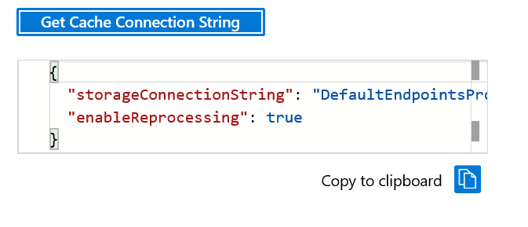

Click on the **Copy to clipboard** button.

Scroll to the bottom of the Indexer Definition JSON file until you see *'cache': null*


Replace *null* with the contents of your clipboard and press *Save*, your indexer defintion JSON should not look something like this:

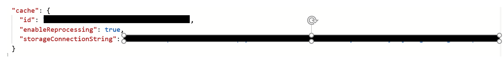

## Editing the Skillset

We are now going to explore how you can add some very powerful skills to your skillset through the Azure Portal Skillsets editor.  This new capability provides a series of JSON templates that you can easily add and modify to suit your customers needs.  For the purposes of today's lab, we will be working with the **Custom Entity Lookup** skill to add a disease lookup skill to our index.

For now, please use the following Azure Portal URL: https://ms.portal.azure.com/?Microsoft_Azure_Search_enableCustomEntityLookup=true.  The Custom Entity Lookup skill template is not yet generally available in the portal, but will be coming soon.

Click on *Azure Cognitive Search* and then select *Skillsets*.  You should see the **clinical-trials-small** skillset.

Click on your skillset and then select **Skillset Definition (JSON)** to view the skillset JSON editor in the Azure Portal.  Exploring your skillset JSON, you will notice there are 8 skills, a Cognitive Services key, and 4 knowledge store table projections.

On the right had side,  you see the Skill Definition Templates that are provided in the Azure Portal.  Click on the drop down arrow in *Skills* and note the variety of templates that are available.  Click on the *Custom Entity Lookup* skill.


Let's look a little deeper at this JSON template. Notice the Custom Entity Lookup skill allows you to specify a list of entities to find in your text. You can provide this list either inline using the *inlineEntitiesDefinition* parameter or via a SAS URI pointing to a JSON file containing the entities using the *entitiesDefinitionUrl* parameter.

For this workshop, we have provided you with a container in your blob storage account named 'disease' which contains a file called 'diseases.json', a list of diseases to be used with the Custom Entity Lookup skill. You will need to retrieve the SAS URI for this file to provide as the *entitiesDefinitionUri* parameter of the skill.

One easy way to retrieve the SAS URI is by using Azure Storage Explorer. You can right-click on the 'diseases.json' file and select *Get Shared Access Signature*. Set the *Expiry time* to some time in the future, and hit the *Create* button. Use the *Copy* button to copy the *URL*.

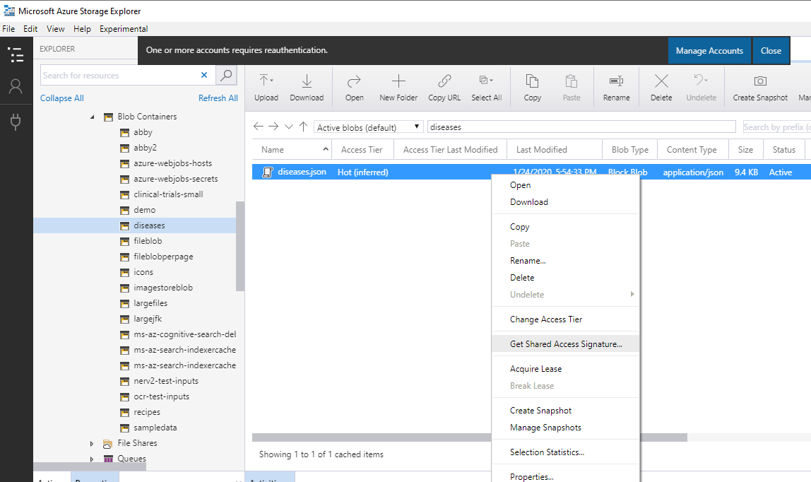
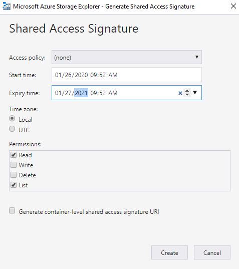
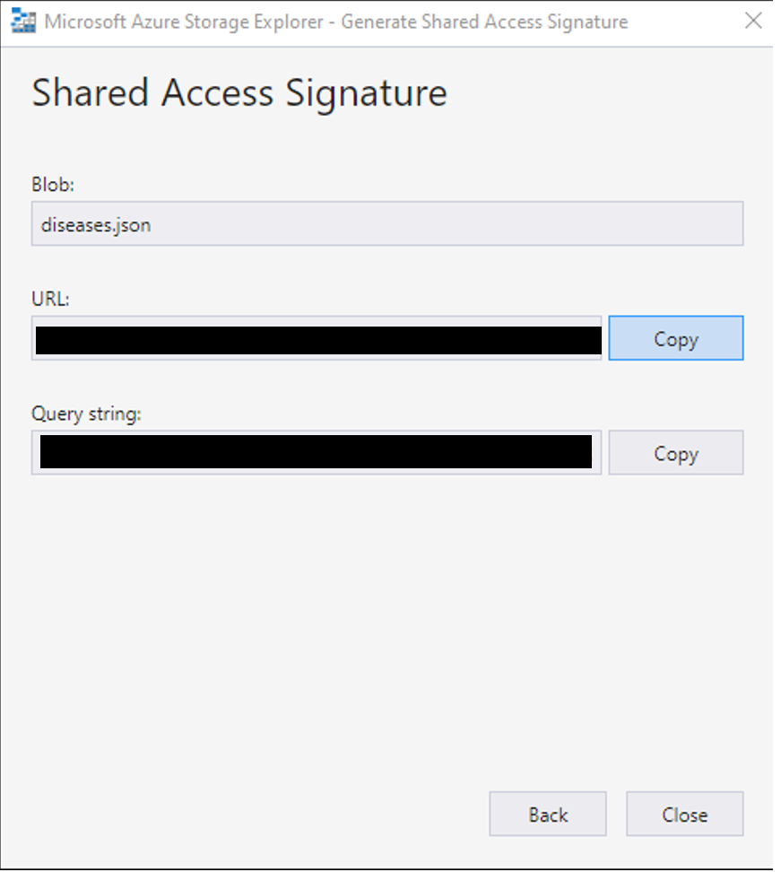

Now you have everything we need to add this skill to your skillset JSON file.  Using the *Custom Entity Lookup Skill* template as a starting guide, fill in all properties as below and add the new skill into the *skills* list in the Skillset JSON.


```
    {
        "@odata.type": "#Microsoft.Skills.Text.CustomEntityLookupSkill",
        "name": "customEntityLookup",
        "description": null,
        "context": "/document/merged_content/sentences/*",
        "defaultLanguageCode": "en",
        "entitiesDefinitionUri": "<enter your SAS URI here>",
        "inputs": [{
            "name": "text",
            "source": "/document/merged_content/sentences/*"
        }],
        "outputs": [{
            "name": "entities",
            "targetName": "diseases"
        }],
        "inlineEntitiesDefinition": []
    }
```

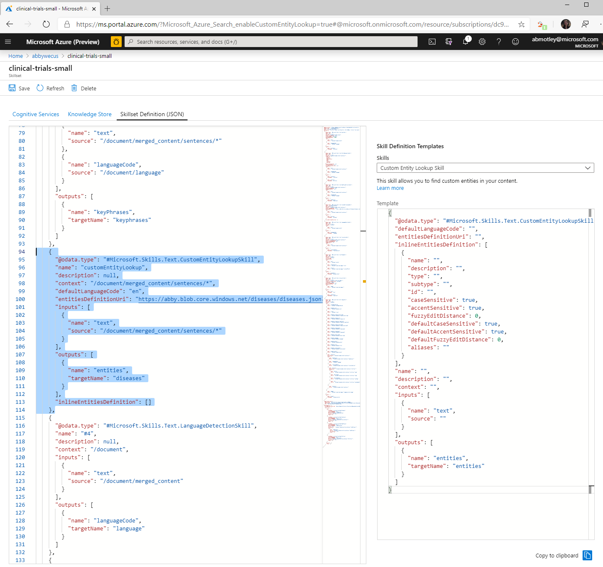

Note that the output of the skill is a complex type. You will notice in the module we'll only be using the *Name* property of the skill result in our index and knowledge store.

```
{
    "Name": "morquio",
    "Matches": [{
        "Text": "morquio",
        "Offset": 25,
        "Length": 7,
        "MatchDistance": 0.0
    }]
}
```

Next, let's add a new knowledge store table projection for the diseases found.

First we need to edit the *Shaper* skill to create the diseases input for projections. Add a new entry to the *inputs* list as shown below.

```
 {
     "name": "diseases",
     "sourceContext": "/document/merged_content/sentences/*/diseases/*",
     "inputs": [{
         "name": "disease",
         "source": "/document/merged_content/sentences/*/diseases/*/Name"
     }]
 }
```


Next we need to add the new *clinicalTrialsSmallDiseases* table projection to the knowledge store. Add a new entry to the *tables* list as shown below.

```
{
    "tableName": "clinicalTrialsSmallDiseases",
    "referenceKeyName": null,
    "generatedKeyName": "Diseaseid",
    "source": "/document/tableprojection/sentences/*/diseases/*",
    "sourceContext": null,
    "inputs": []
}
```


Click the *Save* button to save the changes. We've now added a new Custom Entity Lookup skill to our skillset and added a new knowledge store table projection to store the results. Next, we need to update our index to add the results of the new skill.

## Editing the Index

Now that we've added the new Custom Entity Lookup skill to the skillset, we need to add a new field to the index to store the results of running the skill.

Click on *Azure Cognitive Search* and then select *Indexes*.  You should see the **clinical-trials-small** index.

Click on your index and then select **Index Definition (JSON)** to view the index JSON editor in the Azure Portal.  

Add a new diseases field to the *fields* list as shown below.

```
{
    "name": "diseases",
    "type": "Collection(Edm.String)",
    "facetable": true,
    "filterable": true,
    "retrievable": true,
    "searchable": true,
    "analyzer": "en.microsoft",
    "indexAnalyzer": null,
    "searchAnalyzer": null,
    "synonymMaps": [],
    "fields": []
}
```

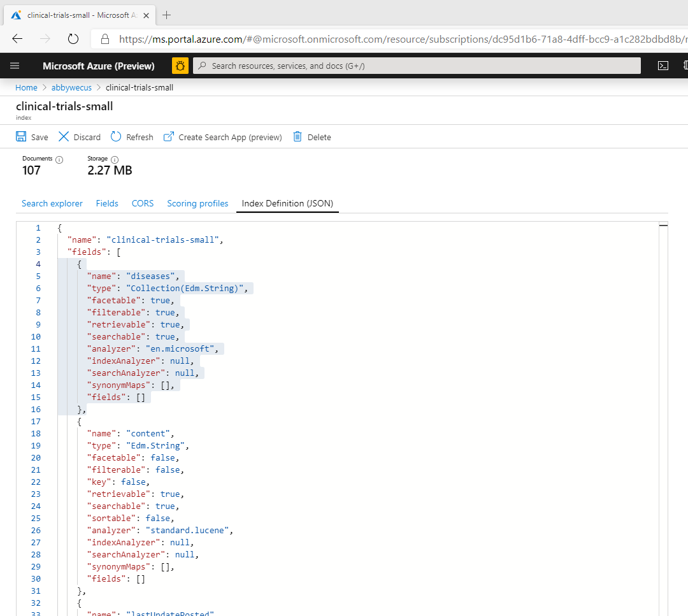

Click the *Save* button to save the changes. We've now added a new index field for our diseases. Last, we need to map the results of the skill to the new index field by updating the indexer's output field mappings.

## Editing the Indexer

The last step we need to take is to edit the output field mappings of the indexer so the result of the new Custom Entity Lookup skill is mapped to our new index field for diseases.

Click on *Azure Cognitive Search* and then select *Indexers*.  You should see the **clinical-trials-small** indexer.

Click on your indexer and then select **Indexer Definition (JSON)** to view the index JSON editor in the Azure Portal.  

Add a new entry to the *outputFieldMappings* list as shown below:

```
{
    "sourceFieldName": "/document/merged_content/sentences/*/diseases/*/Name",
    "targetFieldName": "diseases"
}
```

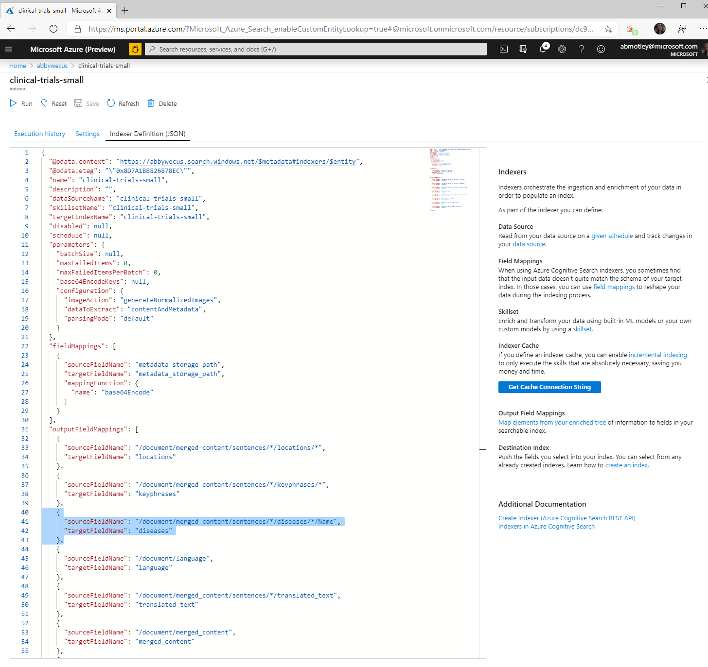

Click the *Save* button to save the changes.

Click the *Run* button to run the indexer again with these changes.

## Results

Wait about 5 minutes for indexer to complete running. After the indexer completes, you can view the new results of your index by using both search explorer and by re-creating your search App as in the previous module.

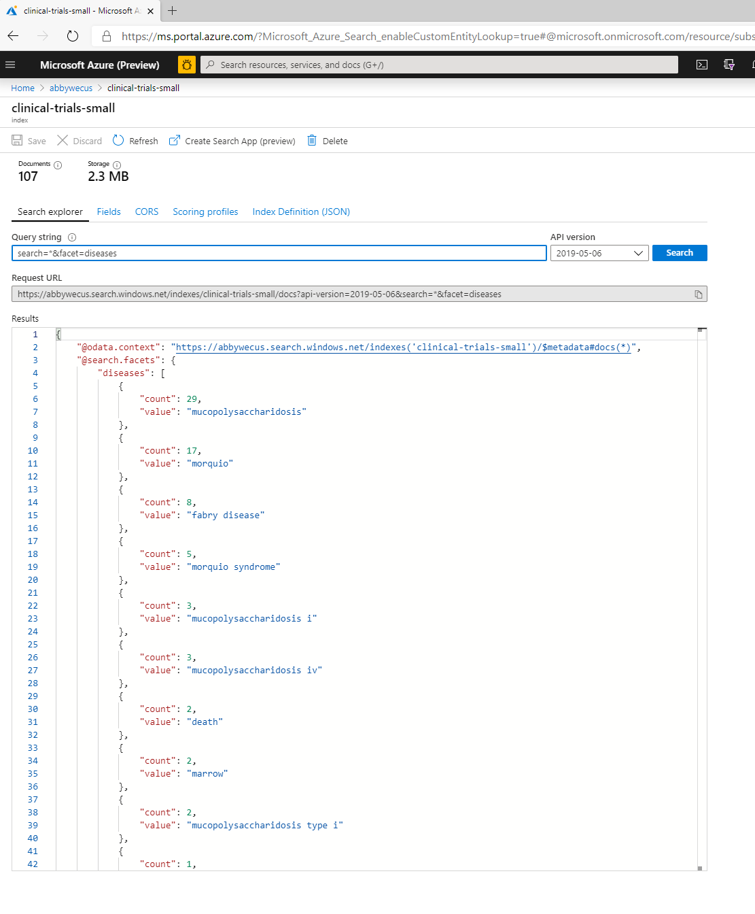

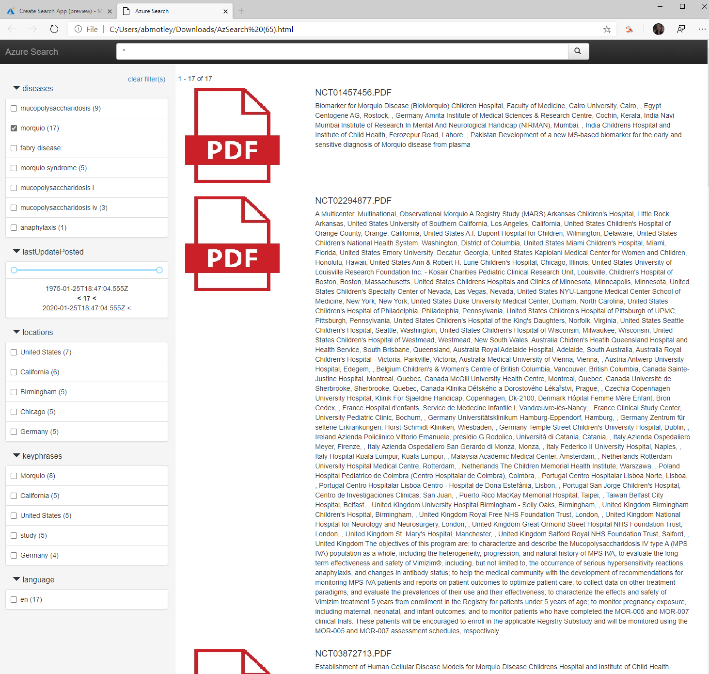


