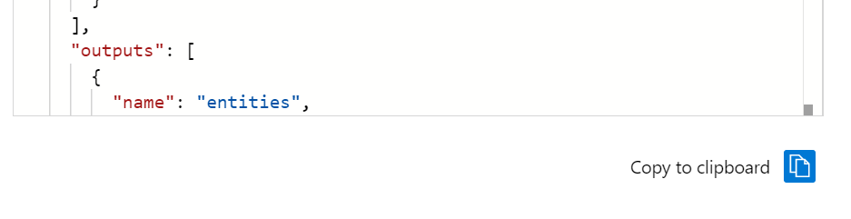

# Using the Azure Portal to edit JSON files

In this module, we will be showing you how you can use an Azure Portal JSON editor to add additional skills to your skillset and modify existing skills.  These 'built-in' skills provide you with a quick and easy way to add additional capabilites to your solution to provide a unique experience for your customer.

## Reprocessor

Before we start adding to our skillset, we will want to enable the new [incremental enrichment](https://docs.microsoft.com/en-us/azure/search/search-howto-incremental-index), or reprocessing capability in Azure Cognitive Search.  This new feature allows you to add caching to the enrichment pipeline so that you can incrementally modify steps without having to rebuild your index.  By default, a skillset is stateless, and changing any part of its composition requires a full rerun of the indexer. With incremental enrichment, the indexer can determine which parts of the document tree need to be refreshed based on changes detected in the skillset or indexer definitions. Existing processed output is preserved and reused wherever possible.

1. Open your Azure Cognitive Search service.
2. Click on the *Indexer* you created in module 1
3. Click on *Indexer Definition (JSON)*.  You will see the JSON defintion of your indexer on the left hand side of the screen.  On the right hand side, you will see some informaton about Indexers and the Indexer Cache.  Click on the blue button **Get Cache Connection String**.

You will now be asked to select the storage account you want to enable the cache for.  Select the *clinical-trials-small* storage and *clinical-trials-small* container we worked with in module 1.  Hit **Select**

You should now see that the box under **Get Cache Connection String** has now been populated with the connection information from your selected storage account.

Click on the **Copy to clipboard** button.

Scroll to the bottom of the Indexer Definition JSON file until you see *'cache': null*

Replace *null* with the contents of your clipboard and press *Save*, your indexer defintion JSON should not look something like this:

## Adding/Modifying Skillset JSON

We are now going to explore how you can add some very powerful skills to your skillset through the Azure Portal Skillsets editor.  This new capability provides a series of JSON templates that you can easily add and modify to suit your customers needs.  For the purposes of today's lab, we will be working with the **Custom Entity Lookup** skill to add a disease lookup skill to our index.

Click on *Azure Cognitive Search* and then select *Skillsets*.  You should see the **clinical-trials-small** index and can note that it currently contains 4 skills.

Click on your index and then select **Skillset Definition (JSON)** to view the skillset JSON editor in the Azure Portal.

On the right had side,  you see the Skill Definition Templates that are provided in the Azure Portal.  Click on the drop down arrow in *Skills* and note the variety of templates that are available.  Click on the *Custom Entity Lookup* skill.

Let's look a little deeper at this JSON template...

Now, click on the *Copy to clipboard* icon at the far bottom right of your screen.

We are now going to add this skill to your skillset JSON file.  Please your cursor, directly under **skills** , hit return to create a new line and then paste the contents of the clipboard into the JSON file.

Modify the words list....

Click Save.....
