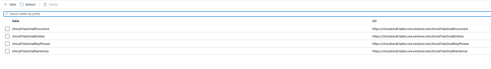
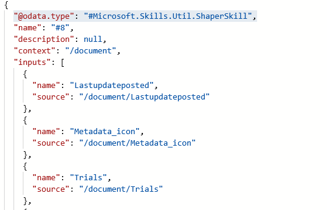
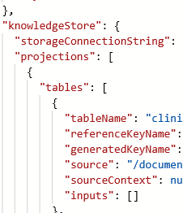
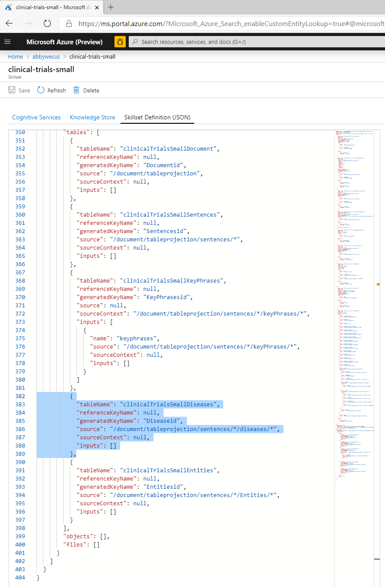
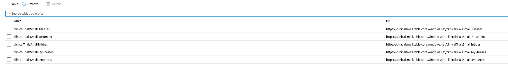

# Module 4: Analyzing extracted data with PowerBI (Optional)
In this optional module, we'll show you how you can further extend visualization of the data through Power BI and how this structured data could be useful in scenarios that go beyond Search. In this module we’ll connect the table projections we created to PowerBI and create a few sample graphs with the extracted data. You'll also get a chance to see the benefits of the cache enabled in module 3 when we make updates to the Knowledge Store.

Let's look at the tables we created when we built the Knowledge Store in module 1:

We see four tables one each for: documents, entities, key phrases and sentences identified in those documents 



*Note - If you would like to explore the data in these tables further, you can also open them through Storage Explorer.*

As you can see, the information that we have projected to the Knowledge Store is structured and could be useful in scenarios that go beyond Search.  For instance, this data could be useful for analytics, to train an ML model, to kick off an RPA or simply to maintain a cache of any extractions we produced. In this module we’ll connect the table projections we created to PowerBI and create a few sample graphs with the extracted data.  But first, we need to add our new *diseases* entity to the Knowledge Store.

# Adding a table projection for diseases in the Knowledge Store.

In module 1, we created a Knowledge Store as part of the index creation process.  In module 3, we added the customEntityLookup skill to extract a new entity, diseases from our data and then we added this field to our search index and modified the indexer to give us the desired output for this data in the *search index*.  However, we still need to add this new skill to the knowledge store so that it can be used as part of the PowerBI visualizations we'll be exploring below.

First we need to edit the [Shaper skill](https://docs.microsoft.com/en-us/azure/search/cognitive-search-skill-shaper) to create the diseases input for projections.  To do this,we will be making another modification to the *Index Skillset Definition JSON*. 

 1. Click on *Azure Cognitive Seach* and select *Skillsets* and click on *clinical-trials-small*.
 2. Click on *Skillset Definition (JSON).*
 3. Scroll down the list of skills until you see the **"@odata.type": "#Microsoft.Skills.Util.ShaperSkill",** (This will likely be the last of the skills defined in your JSON file).
 
 
 
You will notice the Shaper skill has several different inputs. Find the input named *sentences*. Here, you will add a new entry to the inputs list of *sentences*.  Cut and paste the code below.

```
 {
     "name": "diseases",
     "sourceContext": "/document/merged_content/sentences/*/diseases/*",
     "inputs": [{
         "name": "disease",
         "source": "/document/merged_content/sentences/*/diseases/*/name"
     }]
 }
```


Next we need to add the new *clinicalTrialsSmallDiseases* table projection to the knowledge store.  Scroll further down the JSON file until you see *knowledgeStore*



Add a new entry to the *tables* list in the knowledge store's *projections* list by cutting and pasting the code below.

```
{
    "tableName": "clinicalTrialsSmallDiseases",
    "referenceKeyName": null,
    "generatedKeyName": "Diseaseid",
    "source": "/document/tableprojection/sentences/*/diseases/*",
    "sourceContext": null,
    "inputs": []
}
```



Click the *Save* button to save the changes. We've now added a new knowledge store table projection to store the results.

To process these changes into the Knowledge Store, we just need to *run* the indexer again. We do not need to reset the indexer because we can take advantage of the incremental processing capability of the cache we added in the first step of module 3. When we run the indexer, Azure Cognitive Search will only be running the Shaper Skill and Knowledge Store updates rather than running all of the skills against the data set.  As a result, the indexer run will be much faster and should only take about 2 minutes.

After the indexer runs, review your knowledge store tables again.  You should now see a new table *Diseases*.



We are now ready to start exploring this data with PowerBI

# Analyzing extracted data with PowerBI

1.	Run **PowerBI Desktop** and click **Get Data**.
 
    
 
2.	Select **Azure** > **Azure Table Storage**, and enter **your account** name.  (This is the name you gave your Azure Storage Account in module 1)
 
    
 
    
 
3.	When prompted, enter the key to your storage account.  You will find this in the Azure Portal as shown below.


4.	Select the 3 tables we just produced, and click **Load**.
 
    
 
5.	Open **Power Query** by clicking the **Edit Queries** command.
 
    
 
    For each of the tables:
    + Remove the **PartitionKey**, **RowKey**, and **Timestamp** columns created by Azure Table storage. Just right click on the Column name, and click **Remove**.  Knowledge store provides relationships used in this analysis.       

    + Expand the **Content** field by clicking the little expand icon on the right of the Content Column.  Select all columns, and uncheck “Use original column name as prefix” as shown below.
 
        
        

    Remember to do this operation for three of the tables.  
 
7.	Change the type of **lastUpdatePosted** in the **Document table** to be of type **Date**.
 
    

8.	Then click **Close and Apply**
 
    

 
9.	Now, we’ll change the relationships so they are bidirectional, this will help us filter the documents whenever we select a disease or a location.
   
+ Click on the Model tab 

    

+ Change the relationships so they are bidirectional. Double click the relationships arrow, then you will see the Edit relationships dialog, and set *Cross Filter Direction* to **Both**. Perform this action for both cases (*Document* <--> *Disease* and *Document* <--> *Entities*)

    

10.	Back on the **Report** tab we will create a few visualizations. Let’s start by creating a table that shows all the entities. Click the table icon, and then drag *disease* into the **Values** field. 

    

    The table  should look like this: 

    
 
11. Let’s add a visualization that shows the incidences of clinical trials over time. 

Add a **Stacked column chart**. For the *Axis* pick the *lastUpdatePosted* field, and select it’s **Date Hierarchy**. 


Then remove **quarter**, **month** and **day** since we only care about the year the clinical trial happened. 

For the value axis, select **Count (DocumentId)** – this will allow us to graph the number of distinct trials per year. You can do this by simply dragging **DocumentId** field into the **Value** field. 


When you select a disease in the diseases table, you should now be able to see the clinical trials that mention that term for any given year. For instance, selecting *mucopolyyssacharidosis*, you should be able to see that there has been an increase in research in this area over the last decade:


 
13. Add a Filled Map Visualization to identify the different countries and research locations for the clinical trials. For the *Location*, select *Entity*, but filter the *Entities* to only *Location Entities*.


 
14. Just for completeness, we’ll add one more table to show us the title of the clinical trials based on our current location/time filter. Select a **Table** visualization, and add **metadata_title** and **lastUpdatePosted** fields from the **clinicalTrialsSmallDocument** table as the Values to visualize, as shown below. 
 
    

    By now, your Report should look like this:

    

Congratulations! Now you have an interactive report. Here are a few fun exercises you could do:

1.	Click over the different years to see how research has evolved over the years in this data set. For instance, you will be able to see that research for *MPS* has actually become more global over the years for instance.

2.	Select a particular disease like *“Hypohidrosis”* and quickly see where the researchers that did that clinical-trial are located. 

3.	Try building your own visualization – notice there are many interesting visualizations in the Visualizations Marketplace.  Here is one we created with the Force-Directed-Graph Visualization to find documents that connect different diseases.
 
    


